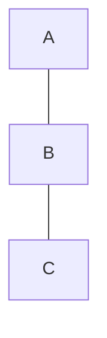
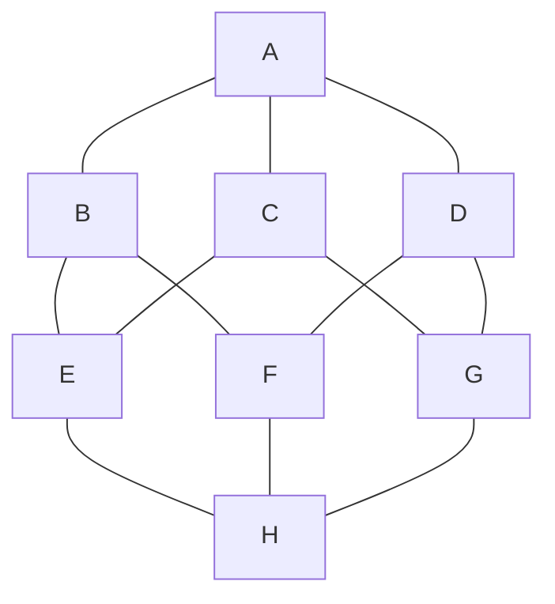
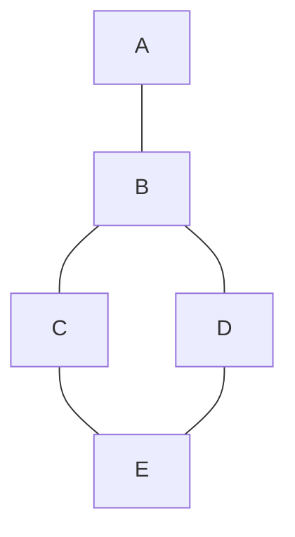
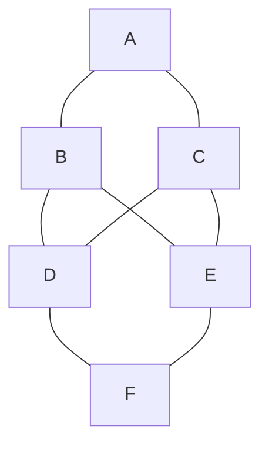
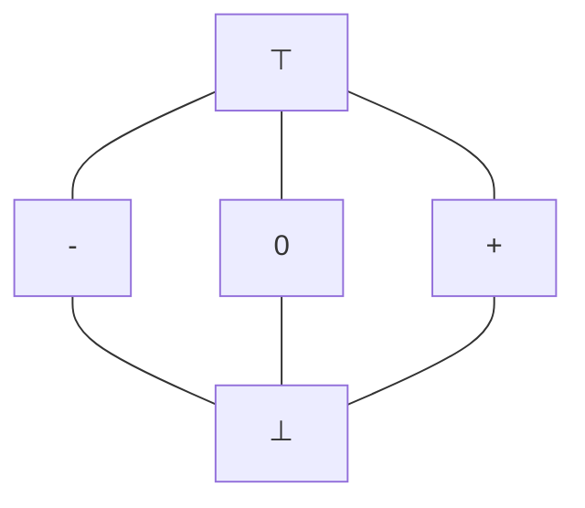

# 50.054 Sign Analysis

## Learning Outcomes

1. Articulate the purpose of sign analysis.
1. Implement the sign analysis using Lattice and Fixed Point Algorithm.

## Exercise 1 

Identify which the following Hasse Diagrams are not complete lattices

### Diagram 1 

### Diagram 2

### Diagram 3

### Diagram 4

## Exercise 2

In the notes, we formulate the sign analysis by defining a abstract domain 

we argue that the above sign abstract values forms a complete lattice.

In Haskell, we implement a complete lattice as a type class. Checkout the project lab 3 template `src/Lang/Simp/Lattice/CompleteLattice.hs`

Complete the type class instance definition in `SignLattice.hs`.

## Exercise 3 

In the same project template, `src/Lang/Simp/Semantic/SignAnalysis.hs`. Complete the definition of the monotone function by implementing the missing cases. 

You should be able to pass all the test cases in `SignAnalysisSpec.hs`

